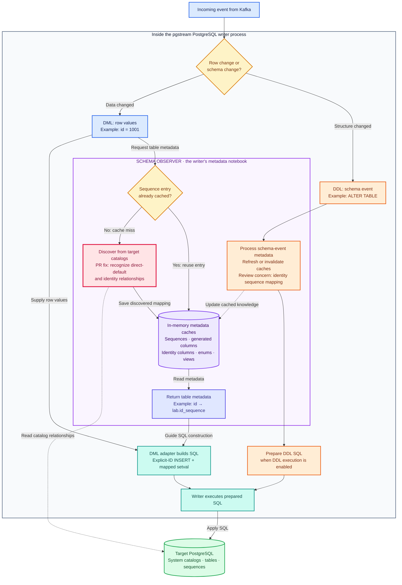
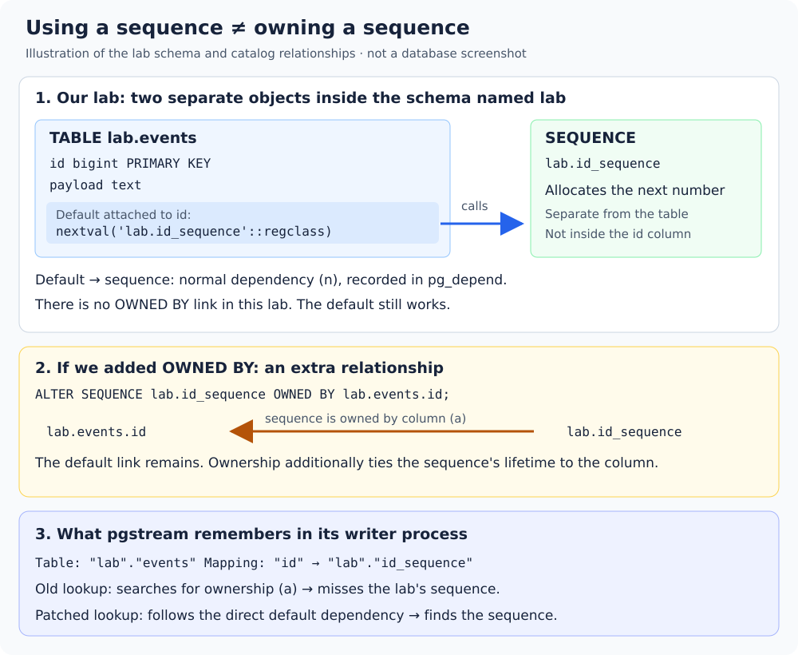
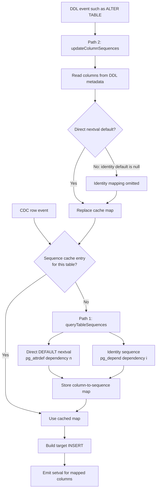

# How pgstream handles PostgreSQL sequences

## The short version

A PostgreSQL CDC event contains the finished row value, such as `id = 1001`. It does not say that PostgreSQL produced the value by calling `nextval('lab.id_sequence')`.

When pgstream writes that event to the target, it inserts the ID explicitly:

```sql
INSERT INTO lab.events (id, payload) VALUES (1001, 'cdc-1');
```

An explicit ID does not invoke the column default, so PostgreSQL does not advance the target sequence. pgstream therefore has separate logic that discovers sequence-backed columns and follows an insert with:

```sql
SELECT setval('lab.id_sequence', 1001, true);
```

The bug was in sequence discovery. The `setval` behavior already existed.

## The complete flow

```text
Source INSERT
    |
    | PostgreSQL chooses id=1001 using nextval(...)
    v
Logical WAL event: { id: 1001, payload: "cdc-1" }
    |
    v
pgstream -> Kafka -> pgstream
    |
    | target schema observer maps id -> lab.id_sequence
    v
Target INSERT with explicit id=1001
    |
    v
Target setval('lab.id_sequence', 1001, true)
```

For a batch of inserts, pgstream uses the largest observed value and emits one `setval` per sequence.

## Reading this lab as a platform engineer

There are three separate kinds of state to reason about: the replicated rows,
the metadata used to interpret those rows, and the sequence that will allocate
the next ID. A healthy row stream does not establish that all three are correct.

The services in [`docker-compose.yml`](docker-compose.yml) divide the work as follows:

| Component | Responsibility in this lab | What its progress does not prove |
| --- | --- | --- |
| Source PostgreSQL | Stores rows and exposes changes through a logical replication slot | That the target has applied those changes |
| `pg2kafka` | Reads source changes and publishes events to Kafka | That the target sequence has advanced |
| Kafka | Holds the event stream in the single `pgstream-sequence-lab` partition | That a target-side default will generate an unused ID |
| `kafka2pg-baseline` or `kafka2pg-fixed` | Reads events, resolves schema metadata, and builds target SQL | That metadata remains correct after every schema change |
| Target PostgreSQL | Executes explicit row writes and the writer's separate sequence updates | That matching row counts imply readiness for application writes |

Both pgstream processes run the same executable with different configurations.
Only the fixed **target writer** receives the candidate patch; the source reader
remains baseline. The target writer also has a source connection configured for
the metadata injector. Do not confuse that with sequence catalog discovery:
the PostgreSQL writer's schema observer queries the **target** database.

For an insert, the useful code-reading path is:

```text
row event -> schema observer -> schemaInfo.sequenceColumns
          -> DML adapter -> explicit INSERT + optional setval
          -> execution on target PostgreSQL
```

The adapter uses `OVERRIDING SYSTEM VALUE` so an insert can preserve a source
value even for `GENERATED ALWAYS AS IDENTITY`. Accepting that explicit value
and advancing the backing sequence are still separate operations. In the
version used here, the sequence updates are built on the INSERT path; they
are not a general-purpose mirror of every source sequence operation.

### What a passing run establishes

[`scripts/run.sh`](scripts/run.sh) performs the snapshot with external
`pg_dump` and `psql` commands. It is not exercising pgstream's own snapshot
implementation. Source writes are deliberately idle between that snapshot and
CDC startup. A production migration with concurrent writes needs a coordinated
snapshot and stream position; copying this script's timing alone would leave
a window for missed changes. PostgreSQL describes the coordinated mechanism
under [exported snapshots](https://www.postgresql.org/docs/16/logicaldecoding-explanation.html#LOGICALDECODING-EXPLANATION-EXPORTSNAPSHOT).

The lab then checks three distinct outcomes:

1. The target contains the expected 1,500 rows.
2. Its sequence has reached the expected value before cutover.
3. After CDC stops, an insert that omits `id` succeeds with 1501.

The baseline passes the first check and fails the other two. That is why this
bug can stay hidden until an application begins writing to the target.

The patched run covers one ascending sequence, one table, one Kafka partition,
and no concurrent target application writes. It does not establish correctness
for identity columns after DDL, crash/replay behavior, shared sequences across
tables, descending sequences, or concurrent source and target writers. The
DDL cache issue below is not exercised by `demo.sh`. A separate
[`reproduce-identity-ddl.sh`](scripts/reproduce-identity-ddl.sh) scenario now
exercises identity behavior after DDL with the same patched writer.

### Sequence state is not a row count or a replication checkpoint

`setval(sequence, 1500, true)` means the next call advances first: with this
lab's increment of one, it returns 1501. With `false`, the next call returns
1500. Read `is_called` together with `last_value` when inspecting a sequence.

Sequence operations are not rolled back like table writes. A failed insert
can consume an ID, and rolling back `setval` does not restore the previous
state. Consequently, gaps do not by themselves indicate lost rows. See
[PostgreSQL sequence semantics](https://www.postgresql.org/docs/16/functions-sequence.html).

The bulk adapter takes the maximum **within the supplied insert events**. It
does not compare that maximum with the sequence's current target value before
issuing `setval`. Do not interpret this as a guarantee that the sequence can
never move backward across batches or concurrent writers. The discovery patch
does not change that behavior.

### Inspect without consuming an ID

From this lab directory, with the database containers running, use the same
read-only query on each side:

```bash
docker compose exec -T source psql -X -U postgres -d lab -c \
  'SELECT count(*) AS rows, max(id) AS max_id FROM lab.events; SELECT last_value, is_called FROM lab.id_sequence;'
docker compose exec -T target psql -X -U postgres -d lab -c \
  'SELECT count(*) AS rows, max(id) AS max_id FROM lab.events; SELECT last_value, is_called FROM lab.id_sequence;'
```

Do not use `nextval` as a read-only probe: it changes the state being inspected.
Also distinguish the script's printed **before-cutover** state from a query
run after it finishes. The baseline's failed cutover insert has already consumed
1001; the fixed run has inserted row 1501 and advanced its sequence to 1501.

For source retention, inspect the replication slot separately:

```bash
docker compose exec -T source psql -X -U postgres -d lab -c \
  "SELECT slot_name, active, restart_lsn, confirmed_flush_lsn, pg_size_pretty(pg_wal_lsn_diff(pg_current_wal_lsn(), restart_lsn)) AS retained_wal_distance FROM pg_replication_slots WHERE slot_name = 'pgstream_sequence_lab_slot';"
```

That WAL distance is an indicator of the slot's retention position, not an
exact disk-usage measurement or proof of target application. An inactive slot
can still retain WAL; monitor this separately from Kafka consumer lag and
target correctness. See [logical replication slots](https://www.postgresql.org/docs/16/logicaldecoding-explanation.html#LOGICALDECODING-REPLICATION-SLOTS).

## Prerequisite: what is the schema observer?

The schema observer is a Go component inside pgstream's PostgreSQL writer.
It is not another Docker container or a service installed inside PostgreSQL.
Think of it as the writer's in-memory notebook about the database structure.

> **Its job is to give the PostgreSQL writer the structural knowledge it needs
> to turn incoming changes into appropriate target SQL.** It discovers and
> caches table metadata, and processes schema-change events to keep that
> knowledge current. The writer uses this information to decide which column
> values to write, which require special handling, and which sequences need
> updating alongside inserts.

The design serves three purposes: **correctness**, by giving SQL generation
the metadata that row values alone do not provide; **efficiency**, by reusing
cached answers instead of repeating catalog queries for every row; and
**separation of responsibilities**, by keeping metadata discovery apart from
SQL construction and execution. This describes its role in the implementation,
rather than a claim about the original authors' design history.

For example, an event containing `id = 1001` does not tell the writer that
`lab.id_sequence` also needs attention. The observer supplies the mapping
from `id` to that sequence. The DML adapter then builds the explicit-ID insert
and the associated `setval` statement, and the writer executes them.

That is why the original fix belongs here: **the writer already knew how to
update a sequence, but discovery failed to tell it which sequence to update.**
The observer's intended contract includes keeping that mapping correct after
schema changes too; the two paths below explain where that contract currently
breaks down.

A row event tells the writer what data changed, for example `id = 1001`.
To turn that event into valid target SQL, the writer also needs to understand
the table: which columns PostgreSQL computes, which columns use sequences,
and which types need special handling. Those facts are **schema metadata**.

### Where it fits inside the writer



**Read the blue row path first:** row values and observer metadata meet at
the DML adapter, which builds SQL for the writer to execute. The pink box
marks the discovery code changed by the original fix. The orange path shows
how schema events can change that same cached knowledge.

This diagram expands the **sequence lookup** inside the observer; the other
metadata caches have their own lookup logic. A cached empty sequence map is
still a “Yes” at the decision, but yields no sequence update. The orange
refresh happens during event preparation, before target DDL execution; the
arrows do not imply that schema changes have already been applied.

**DML** means data changes such as `INSERT`, `UPDATE`, and `DELETE`.
**DDL** means structure changes such as `CREATE TABLE` and `ALTER TABLE`.
The observer reacts to schema events passed through pgstream; its name does
not mean it continuously polls every target table for changes.

The observer supplies metadata. The DML adapter constructs statements such
as `INSERT` and `setval`; the writer's execution machinery sends those
statements to PostgreSQL. These are separate responsibilities within the
writer process.

### What the notebook contains

The observer holds several caches, not just the sequence mapping:

| Metadata | Why the writer needs it |
| --- | --- |
| Generated columns | Omit values that PostgreSQL must compute itself |
| `GENERATED ALWAYS AS IDENTITY` columns | Avoid unsupported explicit assignments in UPDATE statements |
| Column-to-sequence mappings | Generate sequence updates alongside replicated inserts |
| Enum column information | Handle database-specific enum types when building or encoding writes |
| Materialized views | Recognize objects the writer should not treat as ordinary writable tables |

### A concrete example: what belongs to what?

Start with the SQL in this lab's [`db/seed.sql`](db/seed.sql):

```sql
CREATE SCHEMA lab;
CREATE SEQUENCE lab.id_sequence;

CREATE TABLE lab.events (
    id bigint PRIMARY KEY DEFAULT nextval('lab.id_sequence'::regclass),
    payload text NOT NULL
);
```

Read the names from left to right:

- `lab` is a schema: a namespace for database objects.
- `lab.events` is a table in that schema. `id` and `payload` are its columns.
- `lab.id_sequence` is a separate sequence in the same schema. It is not
  stored inside the table or the `id` column.
- The **default attached to `id`** calls that sequence when an insert omits
  the ID. A primary key enforces uniqueness; it does not itself generate IDs.



*This is an explanatory illustration, not captured database output.
[Open the full-size diagram](docs/images/sequence-relationships.svg).*

On a fresh database, before seeding any rows:

```sql
INSERT INTO lab.events (payload) VALUES ('hello') RETURNING id;
-- Returns 1: the default called nextval.

INSERT INTO lab.events (id, payload) VALUES (100, 'copied row');
-- Stores 100 explicitly: the default is not called.
-- The sequence is still at 1 in this example.
```

This is why copying a row and advancing a sequence are separate jobs.

### “Uses this sequence” is different from “owns this sequence”

Our lab's default **uses** `lab.id_sequence`, but the sequence is not
**owned by** `lab.events.id`. PostgreSQL allows this arrangement.

For comparison, this additional statement would establish ownership:

```sql
-- Illustration only: do not add this to the reproduction setup.
ALTER SEQUENCE lab.id_sequence OWNED BY lab.events.id;
```

It adds a lifecycle relationship: dropping the owning column or its table
also drops the owned sequence. It does not create the `nextval` default;
that default already exists in our example. Here, “owned by” means a
sequence-to-column relationship, not the database role that owns an object.

| Relationship | In the original lab? | What it means |
| --- | --- | --- |
| Default → sequence | Yes | The default expression depends on the sequence it calls |
| Sequence → owning column | No | If added, the sequence belongs to that column's lifecycle |

The old discovery query searched for the second relationship. Our lab only
has the first, so the query missed a sequence that the column really uses.
The patch follows the first relationship and verifies that the default is
exactly a direct `nextval` expression.

### Why would someone use OWNED BY?

Think of it as saying: **“This number generator belongs to this column's
lifecycle. Manage them together.”** It is useful when a sequence exists
solely to generate IDs for one column.

For example, if `orders_id_seq` serves only `orders.id`, keeping it after
removing the orders table would leave an unused database object. With
`OWNED BY orders.id`, dropping the column or table automatically removes
its sequence too. The table and sequence must be in the same schema and
have the same database-role owner. See PostgreSQL's
[`OWNED BY` documentation](https://www.postgresql.org/docs/16/sql-createsequence.html).

Ownership also affects resetting a table for a fresh start:

```sql
-- Destructive example only: empties the table. Not a lab setup step.
TRUNCATE lab.events RESTART IDENTITY;
```

`RESTART IDENTITY` restarts sequences **owned by** columns of that table.
It does not restart an unowned sequence just because a column default calls
it. Plain `TRUNCATE` defaults to `CONTINUE IDENTITY`, which leaves sequence
values unchanged. See [PostgreSQL TRUNCATE](https://www.postgresql.org/docs/16/sql-truncate.html).

| Operation | Sequence owned by this column | Unowned sequence used by its default |
| --- | --- | --- |
| Drop the table, assuming no other dependencies block it | Sequence is dropped with it | Sequence remains |
| `TRUNCATE ... RESTART IDENTITY` | Sequence is restarted | Sequence is not restarted by this operation |
| Insert an explicit ID, such as `id = 100` | Does not advance the sequence | Does not advance the sequence |

### Why deliberately leave a sequence unowned?

Imagine two tables using a common ticket-number generator:

```text
online_orders.id ── default calls ──┐
                                   ├── shared_ticket_sequence
store_orders.id  ── default calls ──┘
```

Tying that sequence's lifetime to just `online_orders.id` would make removal
of that table affect a generator still needed by `store_orders`. Leaving it
unowned lets the application or migration scripts manage its lifetime
independently. This is a PostgreSQL design example, not a claim that this
lab tests shared-sequence replication.

A sequence may also be managed separately from tables, or referenced from
another schema. A direct `nextval` default remains valid without an ownership
link. “Unowned” here only means not owned by a **column**; the sequence still
has a database role as its owner.

For our bug, adding `OWNED BY` would supply the relationship the old discovery
query expected, but would also change the schema's lifecycle behavior. It is
not a universal substitute for fixing discovery. pgstream must recognize the
valid unowned direct-default case too. Ownership itself never keeps a target
sequence synchronized with explicitly replicated IDs; the writer still needs
its separate sequence-update logic.

### How PostgreSQL describes this in its catalogs

PostgreSQL maintains system tables describing the objects you create. You
write `CREATE TABLE`; PostgreSQL creates the corresponding catalog records.
The observer reads those records to discover relationships.

This is a simplified view of the relevant records, **not literal query output**:

| Catalog | Facts recorded for this example |
| --- | --- |
| `pg_namespace` | A schema named `lab` exists |
| `pg_class` | `events` is a table; `id_sequence` is a sequence; both belong to `lab` |
| `pg_attribute` | Table `events` has columns `id` and `payload` |
| `pg_attrdef` | The default for `events.id` is `nextval('lab.id_sequence'::regclass)` |
| `pg_depend` | That default depends on the sequence: a normal dependency, `n` |

Real catalog records connect objects using internal numeric identifiers
called **OIDs**, plus column numbers where needed. The observer joins these
records and resolves them into names. It does not infer ownership from a
name such as `id_sequence`.

For an ordinary `OWNED BY` relationship, `pg_depend` would also contain an
automatic dependency, `a`, from the sequence to the column. Identity columns
have a different internal relationship, `i`, explained in the two-path section.

### What ends up in pgstream's notebook?

After discovering our direct-default relationship, the observer stores:

```text
Table:    "lab"."events"
Mapping:  "id" -> "lab"."id_sequence"
```

Read that as: “When writing an ID to `lab.events`, the associated sequence
is `lab.id_sequence`.” This is an in-memory lookup in the writer process;
it is not a new ownership relationship in PostgreSQL.

The target catalogs and incoming schema-event metadata are distinct sources
of information. The two paths in the next section explain how each can
populate the same sequence cache.

### Why cache it, and what does a cache hit mean?

Looking up the same table's structure for every replicated row would repeatedly
query PostgreSQL. Instead, the observer remembers the answer and reuses it.
These caches belong to the running writer process; they are not persisted
in Kafka or shared automatically between writer instances.

There are three important states:

| Cache state for a table | Meaning to the current sequence lookup |
| --- | --- |
| No entry | Metadata is unknown; query the target catalogs |
| Entry containing a mapping | Reuse the known sequence mapping |
| Entry containing an empty map `{}` | Reuse the answer that no sequence columns were found |

An empty answer is still a **cache hit**. It does not cause another catalog
query. If a refresh mistakenly stores `{}`, subsequent rows can keep using
that incorrect answer even though the target database has a sequence.

**Refresh** means replacing a cached answer with newly computed metadata.
**Invalidation** means removing the answer so the next lookup must discover
it again. Neither is inherently sufficient: a refresh must include all needed
metadata, and a lookup after invalidation must observe the correct schema state.

### Why schema changes need special care

A table's structure can change while CDC runs. Remembering its original
structure forever would leave the writer using stale metadata. That is why
the observer also processes DDL events.

In the reviewed code, the event adapter updates observer state while preparing
a DDL event, before the resulting SQL is executed on the target. Therefore,
replacing an event-based refresh with a live catalog query is not automatically
safe: the target may still have the old structure at that point. Any such
change needs to verify execution ordering and when subsequent rows obtain
their metadata.

Sequence metadata also interacts with the other caches. In this code,
`updateGeneratedColumnNames` uses `DDLColumn.IsGenerated()`, which includes
identity columns. The DML adapter filters those columns from inserted values.
Consequently, a test after DDL must verify that the target preserves the
**source row's actual ID**, as well as checking sequence state. Consecutive
IDs alone can hide the target accidentally generating a matching ID itself.

These are implementation details to account for when designing a fix. The
original `demo.sh` workload does not exercise them; the separate identity-DDL
script below demonstrates their combined effect on copied row IDs.

### Local code-reading landmarks

The relevant functions are under `pkg/wal/processor/postgres/` in pgstream:

- `postgres_wal_adapter.go`: `walEventToQueries` and `walEventToMessage`
  route events and call the observer.
- `postgres_schema_observer.go`: `getSchemaInfo` gathers metadata;
  `getSequenceColumns` reads or populates the sequence cache; `update`
  handles schema-event metadata.
- `postgres_wal_dml_adapter.go`: `buildInsertQueries` uses that metadata
  to construct row inserts and sequence updates.
- `postgres_wal_dml_adapter_bulk.go`: `buildBulkInsertQueries` handles
  groups of inserts and their sequence updates.

The DDL column helpers, including `GetSequenceName` and `IsGenerated`, live
in `pkg/wal/wal_ddl.go`. This walkthrough was checked against the local PR
checkout at `c36b327`; the runnable lab builds `v1.3.1` plus its bundled patch.

## The schema observer has two sequence-metadata paths

The PostgreSQL writer does not inspect the database catalogs for every row. Its
schema observer keeps a cache shaped like this:

```text
schema.table -> column -> qualified sequence

"lab"."events" -> "id" -> "lab"."id_sequence"
```

There are two different paths that can populate or replace that cache:



The important design detail is that these paths are **two writers to the same
cache**. Correctness therefore requires both paths to recognize the same kinds
of sequence-backed columns.

### Path 1: lazy catalog discovery

When a row arrives and the table has no cache entry, `getSequenceColumns` calls
`queryTableSequences`. The query inspects the target PostgreSQL catalogs and
stores the result:

```text
cache miss
    -> query pg_attribute / pg_attrdef / pg_depend / pg_class
    -> discover "id" -> "lab"."id_sequence"
    -> cache the mapping
    -> build INSERT and setval
```

The candidate fix in this lab changes this path. These are the relevant catalog
relationships:

| Column form | Relationships stored by PostgreSQL | Edge followed by the fixed query |
| --- | --- | --- |
| `serial` or an owned sequence with a direct default | default to sequence (`n`), plus sequence ownership (`a`) | default to sequence (`n`) |
| unowned direct `DEFAULT nextval(...)` | default to sequence (`n`) only | default to sequence (`n`) |
| `GENERATED ... AS IDENTITY` | internal sequence-to-column relationship (`i`), without an ordinary default | internal relationship (`i`) |

The old query followed only the ownership edge (`a`). Issue #1203 is the second
row, where that edge does not exist. The PR follows the direct-default edge (`n`)
and separately preserves identity discovery through the internal edge (`i`).

### Path 2: eager refresh after a DDL event

When pgstream observes a DDL event, it does not wait for a cache miss. It calls
`updateColumnSequences` and rebuilds the map from the columns carried in the DDL
event.

For an ordinary direct default, that event contains data resembling:

```json
{
  "name": "id",
  "default": "nextval('lab.id_sequence'::regclass)",
  "identity": null
}
```

`DDLColumn.HasSequence()` parses `default`, finds `nextval(...)`, and retains the
mapping.

An identity column is represented differently:

```json
{
  "name": "id",
  "default": null,
  "identity": "ALWAYS"
}
```

PostgreSQL records the identity marker in `pg_attribute.attidentity` and the
backing sequence relationship as an internal `pg_depend` entry. It does not put
an ordinary default for the identity column in `pg_attrdef`. Consequently:

```text
Default == nil
    -> GetSequenceName() returns ""
    -> HasSequence() returns false
    -> updateColumnSequences omits the identity column
```

Worse, the observer stores the rebuilt empty map. A later row sees a successful
cache hit with `{}` and does not retry the corrected catalog query from Path 1.

### The review corner case as cache states

Assume Path 1 has already discovered the identity sequence:

```text
Before DDL:
"public"."orders" -> { "id": "public"."orders_id_seq" }
```

Now the source executes an unrelated schema change:

```sql
ALTER TABLE public.orders ADD COLUMN note text;
```

The DDL event includes `id` with `identity = "ALWAYS"` and `default = null`.
Path 2 reconstructs and replaces the cache:

```text
After DDL:
"public"."orders" -> {}
```

The SQL in Path 1 is correct, but it is no longer reached because the empty map
is still a cache entry. This is the lifecycle corner case identified during PR
review.

### Why the original lab did not reveal Path 2

The current `demo.sh` workload creates the table before streaming, snapshots it,
and then sends only row inserts during CDC. That is exactly the Path 1 scenario:

```text
empty observer cache -> first row -> catalog query -> cached mapping
```

It never performs an `ALTER TABLE` after streaming starts, so
`updateColumnSequences` never replaces the mapping. The lab proved that the new
catalog query fixes issue #1203, but it did not yet prove that the mapping
survives the complete schema-observer lifecycle.

That distinction is useful when testing cache-backed systems: test both the
cache-miss loader and every path that refreshes, replaces, or invalidates the
same cache entry.

### Reproduce the identity-DDL path with the current patch

Run this separate scenario from the lab directory:

```bash
bash scripts/reproduce-identity-ddl.sh
```

It uses `v1.3.1` with the **same discovery patch** as `demo.sh fixed`. No fix
for the review concern is applied. It runs under a separate Compose project
with separate volumes and ports; see the [README](README.md#separate-reproduction-identity-columns-after-ddl)
for inspection, rebuild, and cleanup commands.

The key SQL is:

```sql
-- Before streaming: create this table and snapshot its first 10 rows.
CREATE TABLE lab.identity_events (
    id bigint GENERATED ALWAYS AS IDENTITY PRIMARY KEY,
    payload text NOT NULL UNIQUE
);

-- With streaming active: exercise discovery and establish a known target state.
SELECT setval('lab.identity_events_id_seq', 1000, true);
INSERT INTO lab.identity_events (payload) VALUES ('before-ddl');
-- Source and target both have this row at id=1001, sequence=1001.

-- Change structure without changing the identity definition.
ALTER TABLE lab.identity_events ADD COLUMN note text;
-- The script waits until note exists on the target before continuing.

SELECT setval('lab.identity_events_id_seq', 2000, true);
INSERT INTO lab.identity_events (payload, note)
VALUES ('after-ddl', 'DDL arrived');
-- Source: id=2001. Observed target: id=1002 instead.
```

The source-side `setval` calls deliberately create gaps; they do not create
DDL events. Using consecutive IDs here could hide a target generating its
own ID instead of preserving the source ID.

The observed result is **more than a lagging sequence**. The DDL refresh also
classifies identity columns as generated, so the insert adapter can omit the
source ID. The target then generates 1002 itself. Meanwhile, the empty sequence
mapping means no corrective `setval` is emitted for that identity column.
Both databases contain the row with payload `after-ddl`, but its ID differs.

The script then restarts only the writer, generates source ID 3001, and checks
that this new row and the target sequence both reach 3001. It also asserts
that the earlier `after-ddl` row is **still 1002 on the target**. Restarting
demonstrates the different behavior of fresh caches; it does not repair data.

These are real end-to-end observations, not direct inspection of Go's in-memory
maps. The cache explanation comes from the observer/adapter code and the
focused unit test that shows the identity mapping being replaced with `{}`.
The reproduction asserts the exact observed bug signature and exits nonzero
if it changes, including if a future writer correctly preserves ID 2001.

## Why the snapshot worked

`pg_dump` handles sequence state separately from table rows. After dumping the first 1,000 rows, it restores the equivalent of:

```sql
SELECT pg_catalog.setval('lab.id_sequence', 1000, true);
```

That is why both databases begin the CDC phase with:

```text
max(id) = 1000
sequence last_value = 1000
```

The later CDC inserts carry IDs 1001 through 1500, but those explicit IDs alone cannot move the target sequence.

## Why the original discovery query missed this sequence

PostgreSQL records object relationships in `pg_depend`. The important detail is that these two schema styles create different relationships.

For `serial`, or a sequence declared `OWNED BY` a column:

```text
sequence -- automatic dependency ('a') --> table column
```

For a standalone sequence referenced only by a default:

```text
column default (pg_attrdef) -- normal dependency ('n') --> sequence
```

### See the difference in PostgreSQL

Create one owned sequence example beside the lab's explicit sequence:

```sql
CREATE TABLE lab.owned_example (
    id bigserial PRIMARY KEY
);
```

PostgreSQL's `pg_get_serial_sequence` function returns a sequence only when it is owned by the column:

```sql
SELECT
    'lab.events' AS table_name,
    COALESCE(
        pg_get_serial_sequence('lab.events', 'id'),
        'NULL (not owned)'
    ) AS owned_sequence
UNION ALL
SELECT
    'lab.owned_example',
    COALESCE(
        pg_get_serial_sequence('lab.owned_example', 'id'),
        'NULL (not owned)'
    );
```

```text
    table_name     |      owned_sequence
-------------------+--------------------------
 lab.events        | NULL (not owned)
 lab.owned_example | lab.owned_example_id_seq
(2 rows)
```

The explicit sequence is still a real dependency, but it belongs to the column's default expression:

```sql
SELECT
    ad.adrelid::regclass AS table_name,
    a.attname AS column_name,
    d.deptype,
    d.classid::regclass AS dependent_catalog,
    d.refobjid::regclass AS referenced_object
FROM pg_depend d
JOIN pg_attrdef ad
    ON d.classid = 'pg_attrdef'::regclass
    AND d.objid = ad.oid
JOIN pg_attribute a
    ON a.attrelid = ad.adrelid
    AND a.attnum = ad.adnum
WHERE d.refclassid = 'pg_class'::regclass
    AND d.refobjid = 'lab.id_sequence'::regclass;
```

```text
 table_name | column_name | deptype | dependent_catalog | referenced_object
------------+-------------+---------+-------------------+-------------------
 lab.events | id          | n       | pg_attrdef        | lab.id_sequence
(1 row)
```

Here `deptype = 'n'` means a normal dependency. Read the row as:

```text
the pg_attrdef for lab.events.id depends on lab.id_sequence
```

By comparison, the `bigserial` example has the ownership relationship the old pgstream query expected:

```sql
SELECT
    s.oid::regclass AS sequence_name,
    t.oid::regclass AS table_name,
    a.attname AS column_name,
    d.deptype
FROM pg_depend d
JOIN pg_class s ON s.oid = d.objid AND s.relkind = 'S'
JOIN pg_class t ON t.oid = d.refobjid
JOIN pg_attribute a
    ON a.attrelid = t.oid
    AND a.attnum = d.refobjsubid
WHERE d.deptype = 'a'
    AND t.oid = 'lab.owned_example'::regclass;
```

```text
      sequence_name       |    table_name     | column_name | deptype
--------------------------+-------------------+-------------+---------
 lab.owned_example_id_seq | lab.owned_example | id          | a
(1 row)
```

Here `deptype = 'a'` is the automatic ownership dependency:

```text
lab.owned_example_id_seq is owned by lab.owned_example.id
```

The original pgstream query only followed the first relationship:

```sql
d.refobjid = table_oid
AND d.refobjsubid = column_number
AND d.deptype = 'a'
```

Running that lookup for the lab table demonstrates the miss:

```sql
SELECT s.oid::regclass AS sequence_name
FROM pg_depend d
JOIN pg_class s ON s.oid = d.objid AND s.relkind = 'S'
WHERE d.refobjid = 'lab.events'::regclass
    AND d.refobjsubid = (
        SELECT attnum
        FROM pg_attribute
        WHERE attrelid = 'lab.events'::regclass
            AND attname = 'id'
    )
    AND d.deptype = 'a';
```

```text
 sequence_name
---------------
(0 rows)
```

The fixed lookup starts from `pg_attrdef`, follows its dependency to the sequence, and finds the missing mapping:

```sql
SELECT
    a.attname AS column_name,
    sn.nspname || '.' || s.relname AS sequence_name
FROM pg_class t
JOIN pg_namespace tn ON tn.oid = t.relnamespace
JOIN pg_attribute a ON a.attrelid = t.oid
JOIN pg_attrdef ad
    ON ad.adrelid = t.oid
    AND ad.adnum = a.attnum
JOIN pg_depend d
    ON d.classid = 'pg_attrdef'::regclass
    AND d.objid = ad.oid
    AND d.refclassid = 'pg_class'::regclass
JOIN pg_class s ON s.oid = d.refobjid AND s.relkind = 'S'
JOIN pg_namespace sn ON sn.oid = s.relnamespace
WHERE tn.nspname = 'lab'
    AND t.relname = 'events'
    AND pg_get_expr(ad.adbin, ad.adrelid)
        = format('nextval(%L::regclass)', s.oid::regclass::text);
```

```text
 column_name |  sequence_name
-------------+-----------------
 id          | lab.id_sequence
(1 row)
```

Our test schema uses the second form:

```sql
CREATE SEQUENCE lab.id_sequence;

CREATE TABLE lab.events (
    id bigint DEFAULT nextval('lab.id_sequence'::regclass)
);
```

The sequence is referenced by the default but is not owned by the column. The old query therefore returned no sequence mapping for `id`. Without that mapping, pgstream generated the target `INSERT` but skipped its existing `setval` query.

The result after replicating 500 rows was:

```text
target max(id) = 1500
target sequence last_value = 1000
```

The next normal target insert called `nextval`, received 1001, and collided with the already replicated row.

## What the fix changes

The patch changes only the catalog lookup in pgstream's PostgreSQL schema observer.

It now:

1. Finds each table column and its `pg_attrdef` default.
2. Follows dependencies from that default to referenced sequence objects.
3. Confirms that the default is exactly a direct `nextval(sequence)` expression.
4. Returns the sequence's real schema and name.
5. Keeps identity columns working through their internal dependency (`deptype = 'i'`).

Once the observer returns this mapping:

```text
"id" -> "lab"."id_sequence"
```

the rest of pgstream is unchanged. Its existing DML adapter sees the inserted `id`, emits `setval`, and the target finishes at sequence value 1500. A target-side insert then safely receives 1501.

## Why the expression check matters

It would be unsafe to treat every default that mentions a sequence as a plain sequence-generated ID. For example:

```sql
DEFAULT nextval('lab.id_sequence') + 100
```

Here the inserted column value and the underlying sequence value differ by 100. Calling `setval(sequence, inserted_id)` would be incorrect.

The fix accepts the canonical direct `nextval(sequence)` form and rejects derived expressions like this one.

## Why pgstream cannot simply compare every primary key

- A primary key can be a UUID, text, composite key, or manually assigned number.
- A sequence-backed column does not have to be the primary key.
- One sequence can live in a different schema from its table.
- Querying PostgreSQL catalogs for every row would add unnecessary work.

pgstream instead discovers and caches the table's sequence-column mapping, then applies it while building target insert queries.

## Relevant pgstream code

- Schema discovery: [`postgres_schema_observer.go`](https://github.com/xataio/pgstream/blob/v1.3.1/pkg/wal/processor/postgres/postgres_schema_observer.go)
- Insert and `setval` generation: [`postgres_wal_dml_adapter.go`](https://github.com/xataio/pgstream/blob/v1.3.1/pkg/wal/processor/postgres/postgres_wal_dml_adapter.go)
- Batched insert handling: [`postgres_wal_dml_adapter_bulk.go`](https://github.com/xataio/pgstream/blob/v1.3.1/pkg/wal/processor/postgres/postgres_wal_dml_adapter_bulk.go)
- Candidate fix used by this lab: [`patches/1203-explicit-sequence.patch`](patches/1203-explicit-sequence.patch)
