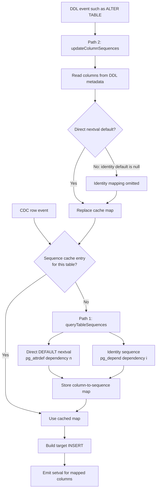

# How pgstream handles PostgreSQL sequences

## The short version

A PostgreSQL CDC event contains the finished row value, such as `id = 1001`. It does not say that PostgreSQL produced the value by calling `nextval('lab.id_sequence')`.

When pgstream writes that event to the target, it inserts the ID explicitly:

```sql
INSERT INTO lab.events (id, payload) VALUES (1001, 'cdc-1');
```

An explicit ID does not invoke the column default, so PostgreSQL does not advance the target sequence. pgstream therefore has separate logic that discovers sequence-backed columns and follows an insert with:

```sql
SELECT setval('lab.id_sequence', 1001, true);
```

The bug was in sequence discovery. The `setval` behavior already existed.

## The complete flow

```text
Source INSERT
    |
    | PostgreSQL chooses id=1001 using nextval(...)
    v
Logical WAL event: { id: 1001, payload: "cdc-1" }
    |
    v
pgstream -> Kafka -> pgstream
    |
    | target schema observer maps id -> lab.id_sequence
    v
Target INSERT with explicit id=1001
    |
    v
Target setval('lab.id_sequence', 1001, true)
```

For a batch of inserts, pgstream uses the largest observed value and emits one `setval` per sequence.

## Reading this lab as a platform engineer

There are three separate kinds of state to reason about: the replicated rows,
the metadata used to interpret those rows, and the sequence that will allocate
the next ID. A healthy row stream does not establish that all three are correct.

The services in [`docker-compose.yml`](docker-compose.yml) divide the work as follows:

| Component | Responsibility in this lab | What its progress does not prove |
| --- | --- | --- |
| Source PostgreSQL | Stores rows and exposes changes through a logical replication slot | That the target has applied those changes |
| `pg2kafka` | Reads source changes and publishes events to Kafka | That the target sequence has advanced |
| Kafka | Holds the event stream in the single `pgstream-sequence-lab` partition | That a target-side default will generate an unused ID |
| `kafka2pg-baseline` or `kafka2pg-fixed` | Reads events, resolves schema metadata, and builds target SQL | That metadata remains correct after every schema change |
| Target PostgreSQL | Executes explicit row writes and the writer's separate sequence updates | That matching row counts imply readiness for application writes |

Both pgstream processes run the same executable with different configurations.
Only the fixed **target writer** receives the candidate patch; the source reader
remains baseline. The target writer also has a source connection configured for
the metadata injector. Do not confuse that with sequence catalog discovery:
the PostgreSQL writer's schema observer queries the **target** database.

For an insert, the useful code-reading path is:

```text
row event -> schema observer -> schemaInfo.sequenceColumns
          -> DML adapter -> explicit INSERT + optional setval
          -> execution on target PostgreSQL
```

The adapter uses `OVERRIDING SYSTEM VALUE` so an insert can preserve a source
value even for `GENERATED ALWAYS AS IDENTITY`. Accepting that explicit value
and advancing the backing sequence are still separate operations. In the
version used here, the sequence updates are built on the INSERT path; they
are not a general-purpose mirror of every source sequence operation.

### What a passing run establishes

[`scripts/run.sh`](scripts/run.sh) performs the snapshot with external
`pg_dump` and `psql` commands. It is not exercising pgstream's own snapshot
implementation. Source writes are deliberately idle between that snapshot and
CDC startup. A production migration with concurrent writes needs a coordinated
snapshot and stream position; copying this script's timing alone would leave
a window for missed changes. PostgreSQL describes the coordinated mechanism
under [exported snapshots](https://www.postgresql.org/docs/16/logicaldecoding-explanation.html#LOGICALDECODING-EXPLANATION-EXPORTSNAPSHOT).

The lab then checks three distinct outcomes:

1. The target contains the expected 1,500 rows.
2. Its sequence has reached the expected value before cutover.
3. After CDC stops, an insert that omits `id` succeeds with 1501.

The baseline passes the first check and fails the other two. That is why this
bug can stay hidden until an application begins writing to the target.

The patched run covers one ascending sequence, one table, one Kafka partition,
and no concurrent target application writes. It does not establish correctness
for identity columns after DDL, crash/replay behavior, shared sequences across
tables, descending sequences, or concurrent source and target writers. The
DDL cache issue below is a source-code/review finding, not a scenario currently
executed by `demo.sh`.

### Sequence state is not a row count or a replication checkpoint

`setval(sequence, 1500, true)` means the next call advances first: with this
lab's increment of one, it returns 1501. With `false`, the next call returns
1500. Read `is_called` together with `last_value` when inspecting a sequence.

Sequence operations are not rolled back like table writes. A failed insert
can consume an ID, and rolling back `setval` does not restore the previous
state. Consequently, gaps do not by themselves indicate lost rows. See
[PostgreSQL sequence semantics](https://www.postgresql.org/docs/16/functions-sequence.html).

The bulk adapter takes the maximum **within the supplied insert events**. It
does not compare that maximum with the sequence's current target value before
issuing `setval`. Do not interpret this as a guarantee that the sequence can
never move backward across batches or concurrent writers. The discovery patch
does not change that behavior.

### Inspect without consuming an ID

From this lab directory, with the database containers running, use the same
read-only query on each side:

```bash
docker compose exec -T source psql -X -U postgres -d lab -c \
  'SELECT count(*) AS rows, max(id) AS max_id FROM lab.events; SELECT last_value, is_called FROM lab.id_sequence;'
docker compose exec -T target psql -X -U postgres -d lab -c \
  'SELECT count(*) AS rows, max(id) AS max_id FROM lab.events; SELECT last_value, is_called FROM lab.id_sequence;'
```

Do not use `nextval` as a read-only probe: it changes the state being inspected.
Also distinguish the script's printed **before-cutover** state from a query
run after it finishes. The baseline's failed cutover insert has already consumed
1001; the fixed run has inserted row 1501 and advanced its sequence to 1501.

For source retention, inspect the replication slot separately:

```bash
docker compose exec -T source psql -X -U postgres -d lab -c \
  "SELECT slot_name, active, restart_lsn, confirmed_flush_lsn, pg_size_pretty(pg_wal_lsn_diff(pg_current_wal_lsn(), restart_lsn)) AS retained_wal_distance FROM pg_replication_slots WHERE slot_name = 'pgstream_sequence_lab_slot';"
```

That WAL distance is an indicator of the slot's retention position, not an
exact disk-usage measurement or proof of target application. An inactive slot
can still retain WAL; monitor this separately from Kafka consumer lag and
target correctness. See [logical replication slots](https://www.postgresql.org/docs/16/logicaldecoding-explanation.html#LOGICALDECODING-REPLICATION-SLOTS).

## The schema observer has two sequence-metadata paths

The PostgreSQL writer does not inspect the database catalogs for every row. Its
schema observer keeps a cache shaped like this:

```text
schema.table -> column -> qualified sequence

"lab"."events" -> "id" -> "lab"."id_sequence"
```

There are two different paths that can populate or replace that cache:



The important design detail is that these paths are **two writers to the same
cache**. Correctness therefore requires both paths to recognize the same kinds
of sequence-backed columns.

### Path 1: lazy catalog discovery

When a row arrives and the table has no cache entry, `getSequenceColumns` calls
`queryTableSequences`. The query inspects the target PostgreSQL catalogs and
stores the result:

```text
cache miss
    -> query pg_attribute / pg_attrdef / pg_depend / pg_class
    -> discover "id" -> "lab"."id_sequence"
    -> cache the mapping
    -> build INSERT and setval
```

The candidate fix in this lab changes this path. These are the relevant catalog
relationships:

| Column form | Relationships stored by PostgreSQL | Edge followed by the fixed query |
| --- | --- | --- |
| `serial` or an owned sequence with a direct default | default to sequence (`n`), plus sequence ownership (`a`) | default to sequence (`n`) |
| unowned direct `DEFAULT nextval(...)` | default to sequence (`n`) only | default to sequence (`n`) |
| `GENERATED ... AS IDENTITY` | internal sequence-to-column relationship (`i`), without an ordinary default | internal relationship (`i`) |

The old query followed only the ownership edge (`a`). Issue #1203 is the second
row, where that edge does not exist. The PR follows the direct-default edge (`n`)
and separately preserves identity discovery through the internal edge (`i`).

### Path 2: eager refresh after a DDL event

When pgstream observes a DDL event, it does not wait for a cache miss. It calls
`updateColumnSequences` and rebuilds the map from the columns carried in the DDL
event.

For an ordinary direct default, that event contains data resembling:

```json
{
  "name": "id",
  "default": "nextval('lab.id_sequence'::regclass)",
  "identity": null
}
```

`DDLColumn.HasSequence()` parses `default`, finds `nextval(...)`, and retains the
mapping.

An identity column is represented differently:

```json
{
  "name": "id",
  "default": null,
  "identity": "ALWAYS"
}
```

PostgreSQL records the identity marker in `pg_attribute.attidentity` and the
backing sequence relationship as an internal `pg_depend` entry. It does not put
an ordinary default for the identity column in `pg_attrdef`. Consequently:

```text
Default == nil
    -> GetSequenceName() returns ""
    -> HasSequence() returns false
    -> updateColumnSequences omits the identity column
```

Worse, the observer stores the rebuilt empty map. A later row sees a successful
cache hit with `{}` and does not retry the corrected catalog query from Path 1.

### The review corner case as cache states

Assume Path 1 has already discovered the identity sequence:

```text
Before DDL:
"public"."orders" -> { "id": "public"."orders_id_seq" }
```

Now the source executes an unrelated schema change:

```sql
ALTER TABLE public.orders ADD COLUMN note text;
```

The DDL event includes `id` with `identity = "ALWAYS"` and `default = null`.
Path 2 reconstructs and replaces the cache:

```text
After DDL:
"public"."orders" -> {}
```

The SQL in Path 1 is correct, but it is no longer reached because the empty map
is still a cache entry. This is the lifecycle corner case identified during PR
review.

### Why the original lab did not reveal Path 2

The current `demo.sh` workload creates the table before streaming, snapshots it,
and then sends only row inserts during CDC. That is exactly the Path 1 scenario:

```text
empty observer cache -> first row -> catalog query -> cached mapping
```

It never performs an `ALTER TABLE` after streaming starts, so
`updateColumnSequences` never replaces the mapping. The lab proved that the new
catalog query fixes issue #1203, but it did not yet prove that the mapping
survives the complete schema-observer lifecycle.

That distinction is useful when testing cache-backed systems: test both the
cache-miss loader and every path that refreshes, replaces, or invalidates the
same cache entry.

## Why the snapshot worked

`pg_dump` handles sequence state separately from table rows. After dumping the first 1,000 rows, it restores the equivalent of:

```sql
SELECT pg_catalog.setval('lab.id_sequence', 1000, true);
```

That is why both databases begin the CDC phase with:

```text
max(id) = 1000
sequence last_value = 1000
```

The later CDC inserts carry IDs 1001 through 1500, but those explicit IDs alone cannot move the target sequence.

## Why the original discovery query missed this sequence

PostgreSQL records object relationships in `pg_depend`. The important detail is that these two schema styles create different relationships.

For `serial`, or a sequence declared `OWNED BY` a column:

```text
sequence -- automatic dependency ('a') --> table column
```

For a standalone sequence referenced only by a default:

```text
column default (pg_attrdef) -- normal dependency ('n') --> sequence
```

### See the difference in PostgreSQL

Create one owned sequence example beside the lab's explicit sequence:

```sql
CREATE TABLE lab.owned_example (
    id bigserial PRIMARY KEY
);
```

PostgreSQL's `pg_get_serial_sequence` function returns a sequence only when it is owned by the column:

```sql
SELECT
    'lab.events' AS table_name,
    COALESCE(
        pg_get_serial_sequence('lab.events', 'id'),
        'NULL (not owned)'
    ) AS owned_sequence
UNION ALL
SELECT
    'lab.owned_example',
    COALESCE(
        pg_get_serial_sequence('lab.owned_example', 'id'),
        'NULL (not owned)'
    );
```

```text
    table_name     |      owned_sequence
-------------------+--------------------------
 lab.events        | NULL (not owned)
 lab.owned_example | lab.owned_example_id_seq
(2 rows)
```

The explicit sequence is still a real dependency, but it belongs to the column's default expression:

```sql
SELECT
    ad.adrelid::regclass AS table_name,
    a.attname AS column_name,
    d.deptype,
    d.classid::regclass AS dependent_catalog,
    d.refobjid::regclass AS referenced_object
FROM pg_depend d
JOIN pg_attrdef ad
    ON d.classid = 'pg_attrdef'::regclass
    AND d.objid = ad.oid
JOIN pg_attribute a
    ON a.attrelid = ad.adrelid
    AND a.attnum = ad.adnum
WHERE d.refclassid = 'pg_class'::regclass
    AND d.refobjid = 'lab.id_sequence'::regclass;
```

```text
 table_name | column_name | deptype | dependent_catalog | referenced_object
------------+-------------+---------+-------------------+-------------------
 lab.events | id          | n       | pg_attrdef        | lab.id_sequence
(1 row)
```

Here `deptype = 'n'` means a normal dependency. Read the row as:

```text
the pg_attrdef for lab.events.id depends on lab.id_sequence
```

By comparison, the `bigserial` example has the ownership relationship the old pgstream query expected:

```sql
SELECT
    s.oid::regclass AS sequence_name,
    t.oid::regclass AS table_name,
    a.attname AS column_name,
    d.deptype
FROM pg_depend d
JOIN pg_class s ON s.oid = d.objid AND s.relkind = 'S'
JOIN pg_class t ON t.oid = d.refobjid
JOIN pg_attribute a
    ON a.attrelid = t.oid
    AND a.attnum = d.refobjsubid
WHERE d.deptype = 'a'
    AND t.oid = 'lab.owned_example'::regclass;
```

```text
      sequence_name       |    table_name     | column_name | deptype
--------------------------+-------------------+-------------+---------
 lab.owned_example_id_seq | lab.owned_example | id          | a
(1 row)
```

Here `deptype = 'a'` is the automatic ownership dependency:

```text
lab.owned_example_id_seq is owned by lab.owned_example.id
```

The original pgstream query only followed the first relationship:

```sql
d.refobjid = table_oid
AND d.refobjsubid = column_number
AND d.deptype = 'a'
```

Running that lookup for the lab table demonstrates the miss:

```sql
SELECT s.oid::regclass AS sequence_name
FROM pg_depend d
JOIN pg_class s ON s.oid = d.objid AND s.relkind = 'S'
WHERE d.refobjid = 'lab.events'::regclass
    AND d.refobjsubid = (
        SELECT attnum
        FROM pg_attribute
        WHERE attrelid = 'lab.events'::regclass
            AND attname = 'id'
    )
    AND d.deptype = 'a';
```

```text
 sequence_name
---------------
(0 rows)
```

The fixed lookup starts from `pg_attrdef`, follows its dependency to the sequence, and finds the missing mapping:

```sql
SELECT
    a.attname AS column_name,
    sn.nspname || '.' || s.relname AS sequence_name
FROM pg_class t
JOIN pg_namespace tn ON tn.oid = t.relnamespace
JOIN pg_attribute a ON a.attrelid = t.oid
JOIN pg_attrdef ad
    ON ad.adrelid = t.oid
    AND ad.adnum = a.attnum
JOIN pg_depend d
    ON d.classid = 'pg_attrdef'::regclass
    AND d.objid = ad.oid
    AND d.refclassid = 'pg_class'::regclass
JOIN pg_class s ON s.oid = d.refobjid AND s.relkind = 'S'
JOIN pg_namespace sn ON sn.oid = s.relnamespace
WHERE tn.nspname = 'lab'
    AND t.relname = 'events'
    AND pg_get_expr(ad.adbin, ad.adrelid)
        = format('nextval(%L::regclass)', s.oid::regclass::text);
```

```text
 column_name |  sequence_name
-------------+-----------------
 id          | lab.id_sequence
(1 row)
```

Our test schema uses the second form:

```sql
CREATE SEQUENCE lab.id_sequence;

CREATE TABLE lab.events (
    id bigint DEFAULT nextval('lab.id_sequence'::regclass)
);
```

The sequence is referenced by the default but is not owned by the column. The old query therefore returned no sequence mapping for `id`. Without that mapping, pgstream generated the target `INSERT` but skipped its existing `setval` query.

The result after replicating 500 rows was:

```text
target max(id) = 1500
target sequence last_value = 1000
```

The next normal target insert called `nextval`, received 1001, and collided with the already replicated row.

## What the fix changes

The patch changes only the catalog lookup in pgstream's PostgreSQL schema observer.

It now:

1. Finds each table column and its `pg_attrdef` default.
2. Follows dependencies from that default to referenced sequence objects.
3. Confirms that the default is exactly a direct `nextval(sequence)` expression.
4. Returns the sequence's real schema and name.
5. Keeps identity columns working through their internal dependency (`deptype = 'i'`).

Once the observer returns this mapping:

```text
"id" -> "lab"."id_sequence"
```

the rest of pgstream is unchanged. Its existing DML adapter sees the inserted `id`, emits `setval`, and the target finishes at sequence value 1500. A target-side insert then safely receives 1501.

## Why the expression check matters

It would be unsafe to treat every default that mentions a sequence as a plain sequence-generated ID. For example:

```sql
DEFAULT nextval('lab.id_sequence') + 100
```

Here the inserted column value and the underlying sequence value differ by 100. Calling `setval(sequence, inserted_id)` would be incorrect.

The fix accepts the canonical direct `nextval(sequence)` form and rejects derived expressions like this one.

## Why pgstream cannot simply compare every primary key

- A primary key can be a UUID, text, composite key, or manually assigned number.
- A sequence-backed column does not have to be the primary key.
- One sequence can live in a different schema from its table.
- Querying PostgreSQL catalogs for every row would add unnecessary work.

pgstream instead discovers and caches the table's sequence-column mapping, then applies it while building target insert queries.

## Relevant pgstream code

- Schema discovery: [`postgres_schema_observer.go`](https://github.com/xataio/pgstream/blob/v1.3.1/pkg/wal/processor/postgres/postgres_schema_observer.go)
- Insert and `setval` generation: [`postgres_wal_dml_adapter.go`](https://github.com/xataio/pgstream/blob/v1.3.1/pkg/wal/processor/postgres/postgres_wal_dml_adapter.go)
- Batched insert handling: [`postgres_wal_dml_adapter_bulk.go`](https://github.com/xataio/pgstream/blob/v1.3.1/pkg/wal/processor/postgres/postgres_wal_dml_adapter_bulk.go)
- Candidate fix used by this lab: [`patches/1203-explicit-sequence.patch`](patches/1203-explicit-sequence.patch)
